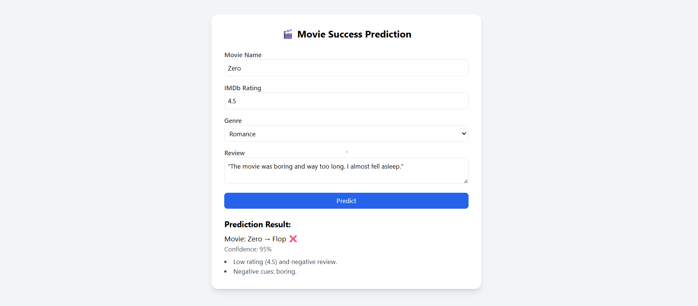
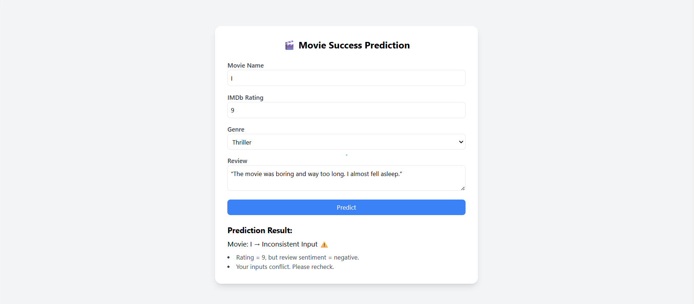
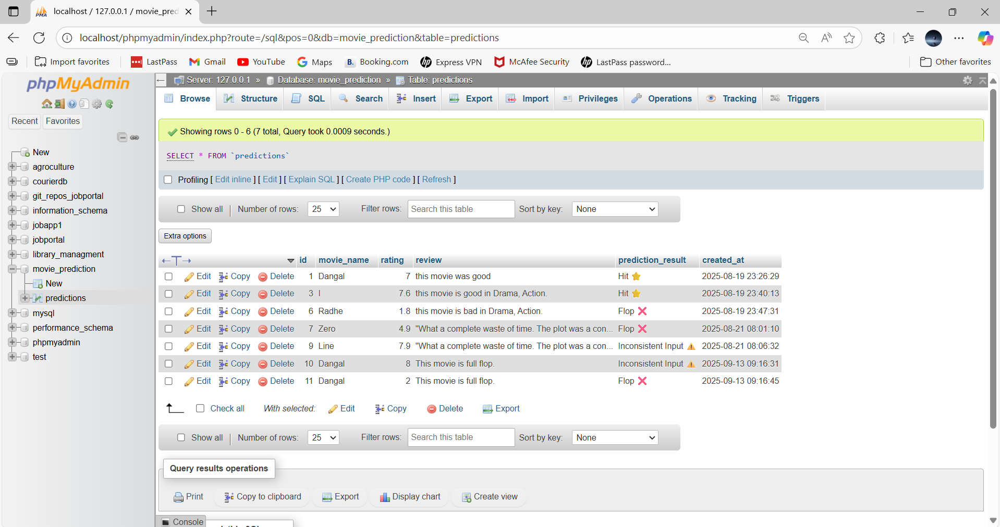

# Movie Success Prediction using Ratings and Reviews

This project predicts whether a movie will be a Hit or Flop by analyzing ratings and audience reviews. It uses Machine Learning models (Logistic Regression & SVM) to combine numerical rating data with sentiment analysis of text reviews. The goal is to help filmmakers, producers, and streaming platforms make data-driven decisions based on audience feedback and rating trends. This was my MCA final year work completed by 2025.

# 🎬 1. Good Film (High Ratings & Positive Reviews)

# 🎬 2.Bad Film (Low Ratings & Negative Reviews)

# 🎬 3. Conflict Film (Mixed Reviews, Polarizing Ratings)

# DataBase for Store the reviews,ratings and film name for feature helps.

# Information on my work:
-- Collecting Revews and Ratings Dataset from IMDb and Kaggle platform!

-- import the impordent packages like SVM, Logistic Rreggression, pandas, numpy, etc.

-- dataset preproccessing and cleaning

-- next train and test the model to split into two parts by 80 and 20

-- next best model select 

-- next all features extract in pkl file 

-- import the pkl file in index.html

-- final check, In user input, How much accurate result be predicut it.

