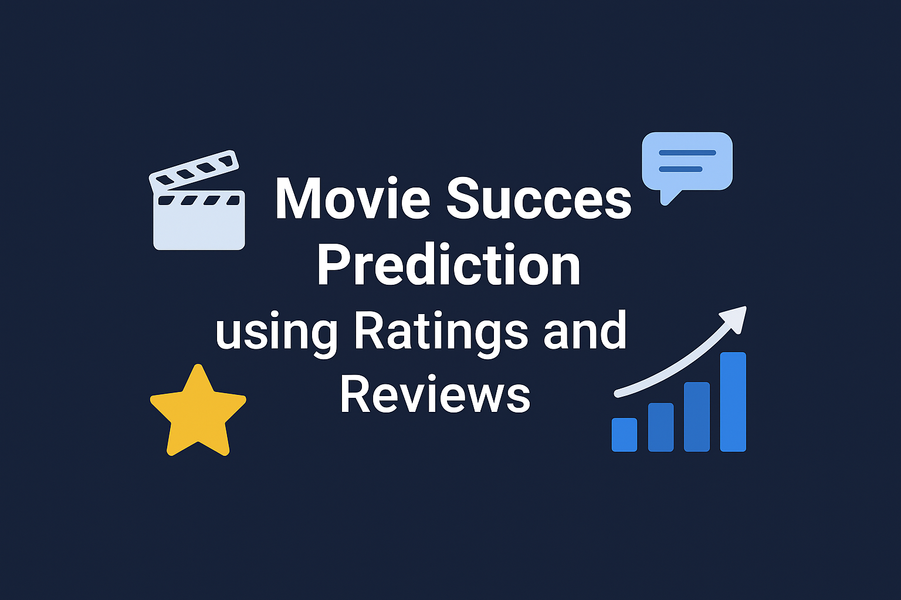

# Movie Success Prediction using Ratings and Reviews

This project predicts whether a movie will be a Hit or Flop by analyzing ratings and audience reviews. It uses Machine Learning models (Logistic Regression & SVM) to combine numerical rating data with sentiment analysis of text reviews. The goal is to help filmmakers, producers, and streaming platforms make data-driven decisions based on audience feedback and rating trends. This was my MCA final year work completed by 2025.

